# SafeZone 3D — Stereo Vision Speed Hump Detection on AWS

A stereo-vision pipeline that detects speed humps and estimates their height in real time, using two cameras, YOLOv8, and OpenCV — deployed on AWS across a two-VPC architecture using EC2, VPC Peering, Application Load Balancer, Auto Scaling Groups, S3, DynamoDB, Lambda, Route 53, ACM, Security Groups, IAM, and CloudWatch.

---

## Architecture Diagram

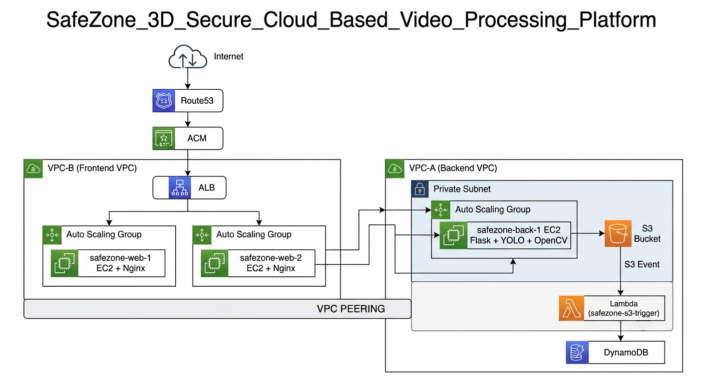

---

## Network Design

The infrastructure is split across two VPCs connected by VPC Peering.

- **VPC-A (Backend)** — runs the Flask + YOLOv8 + OpenCV processing server in a private subnet, with no route to the internet. It's only reachable from VPC-B.
- **VPC-B (Frontend)** — hosts the public-facing web tier (public subnet) and forwards processing requests to VPC-A over the peering connection (private subnet).

Keeping the processing server in a private subnet means it's never directly exposed to the internet — all traffic to it has to come through the frontend tier first. Route tables enforce this at the subnet level (no `0.0.0.0/0 → Internet Gateway` entry on VPC-A's private subnet), and Security Groups enforce it at the instance level (the backend SG only allows inbound traffic from the frontend SG).

> 📁 See the image reference below
---

## AWS Services Used

**Route 53** — manages DNS for the custom domain (`ayushc.in`) and routes it to the ALB.

**ACM** — issues and auto-renews the SSL/TLS certificate, attached to the ALB listener for HTTPS.

**Application Load Balancer** — terminates TLS, runs health checks on the frontend instances, and distributes incoming traffic across them.

**Auto Scaling Groups** — keep both the frontend and backend EC2 instances running at a defined minimum, replacing any instance that fails a health check.

**EC2** — two roles: the frontend instance runs Nginx and serves the web UI; the backend instance runs the Flask API (`app.py`) under Gunicorn along with the YOLOv8/OpenCV processing (`aws_processor.py`).

**S3** — stores the final processed dashboard videos after processing completes.

**Lambda** — triggered by an S3 upload event; writes job metadata to DynamoDB once a new video lands in the bucket.

**DynamoDB** — stores detection metadata per job: peak height, frame count, S3 key, timestamp, status.

**CloudWatch** — collects logs from the Lambda function and health/metric data from the EC2 instances.

> 📁 See the image reference below

---

## How It Works

1. **Record** — `local_capture.py` runs on a laptop with two USB cameras, saving a raw 2560×720 side-by-side stereo video.
2. **Upload** — The video is uploaded through the web frontend, which forwards it to the backend over the VPC peering connection.
3. **Process** — `aws_processor.py` splits the stereo frame, rectifies both halves using the calibration data, runs YOLOv8 detection, computes disparity (StereoSGBM + WLS filtering), and calculates distance and height.
4. **Store + notify** — The processed dashboard video is uploaded to S3; the S3 event triggers a Lambda function that writes metadata to DynamoDB.
5. **Stream back** — The frontend polls the job status endpoint, then streams the finished video back via HTTP Range requests.

```
Laptop (2 cams) → ALB → Frontend EC2 (Nginx) → VPC Peering → Backend EC2 (Flask + YOLOv8 + OpenCV)
                                                                        ↓
                                                          S3 (video) → Lambda → DynamoDB
                                                                        ↓
                                                          Browser streams result back
```

---

## Repo Structure

```
.
├── app.py                  # Flask API — upload, job polling, S3 streaming
├── aws_processor.py        # Core pipeline: rectify → CLAHE → SGBM/WLS → YOLO → graph
├── local_capture.py        # Run on laptop — captures raw stereo video from 2 cams
├── index.html              # Frontend — upload / processing / results UI
├── requirements.txt
├── .gitignore
├── SETUP.md                 # ⚠ read this before running — calibration file notice
└── docs/                   # architecture + screenshot images (see table below)
```

> **Not included in this repo:** `stereo_map.xml` (camera calibration) and `best.pt` (YOLOv8 weights). See [`SETUP.md`](./SETUP.md).

### Image reference

**VPC-A — backend processing network (private subnet)**
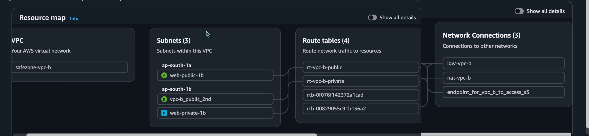

**VPC-B — frontend network (public + private subnet)**
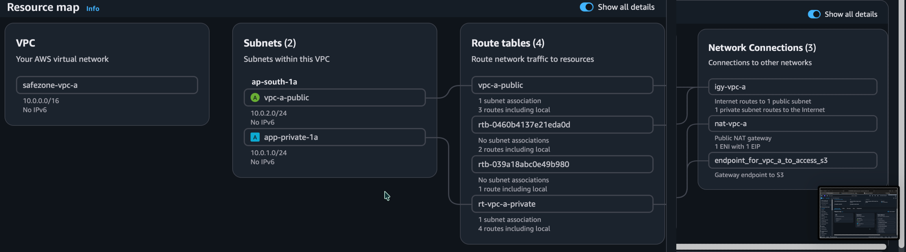

**VPC peering connection between A and B**
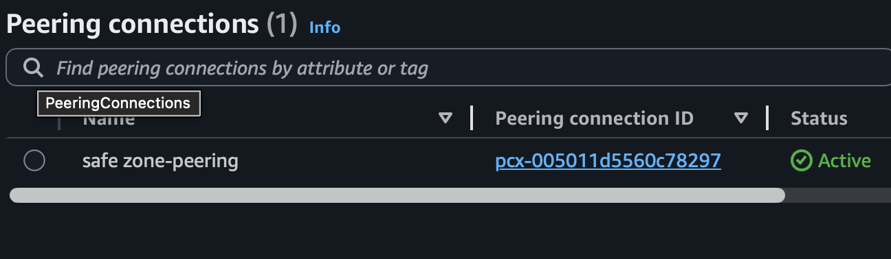

**Route tables controlling subnet-level access**


**Application Load Balancer config**
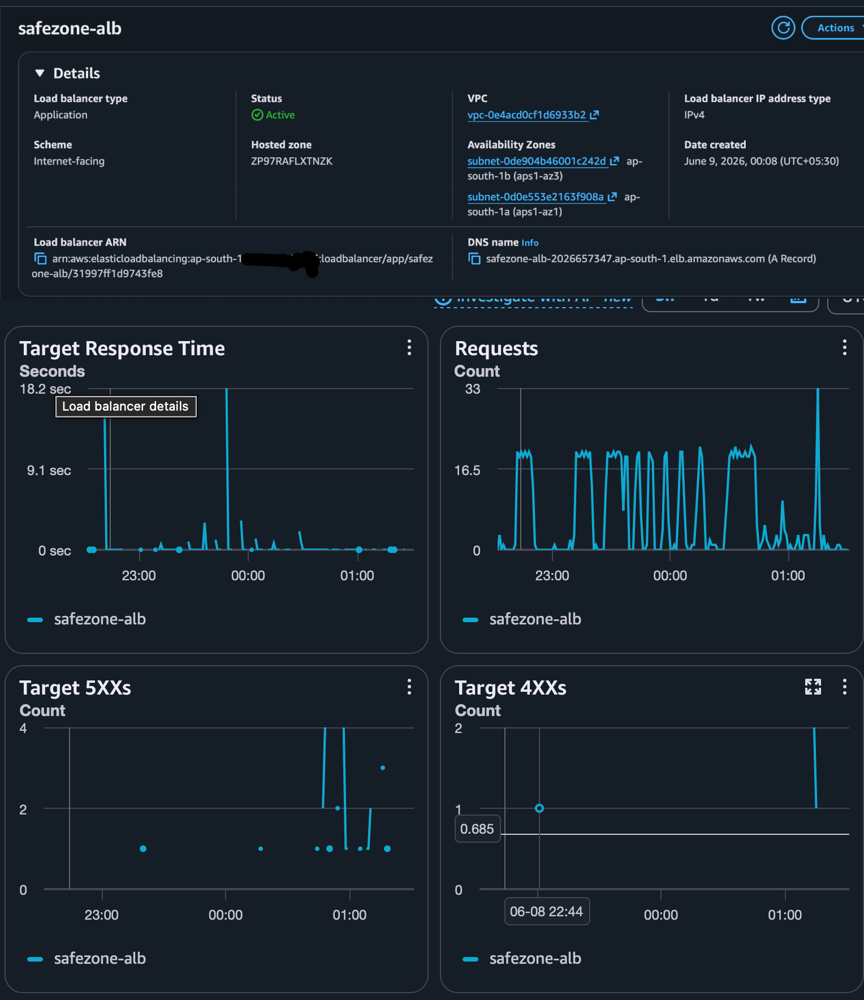

**Auto Scaling Groups (frontend + backend)**
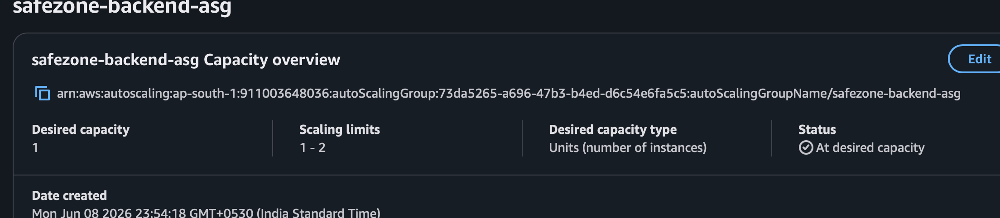

**Route 53 hosted zone / DNS records**
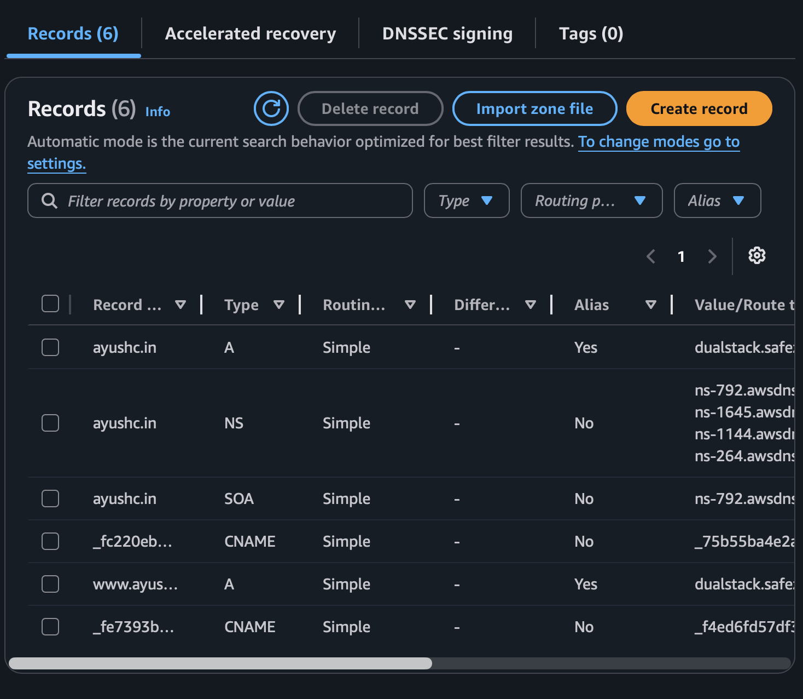

**S3 bucket storing processed videos**
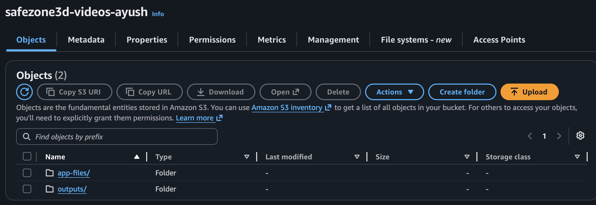

**DynamoDB table + items**
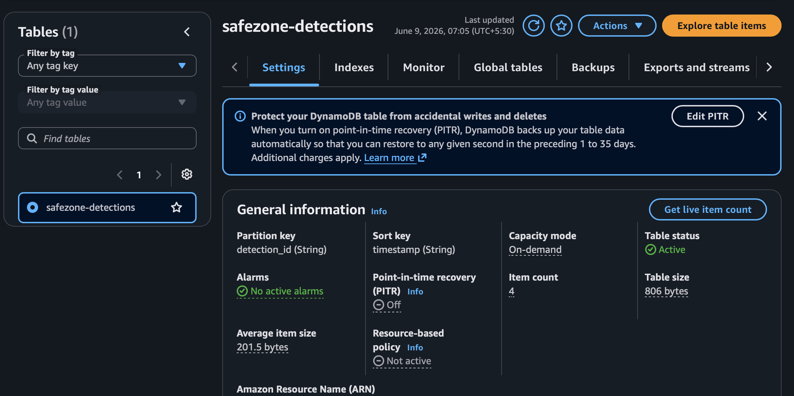

**Lambda trigger config (S3 event source)**
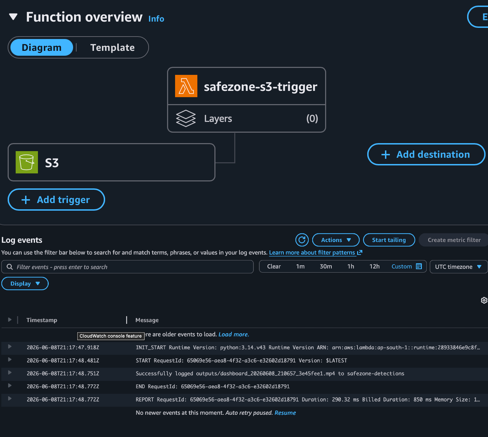

**ACM certificate**
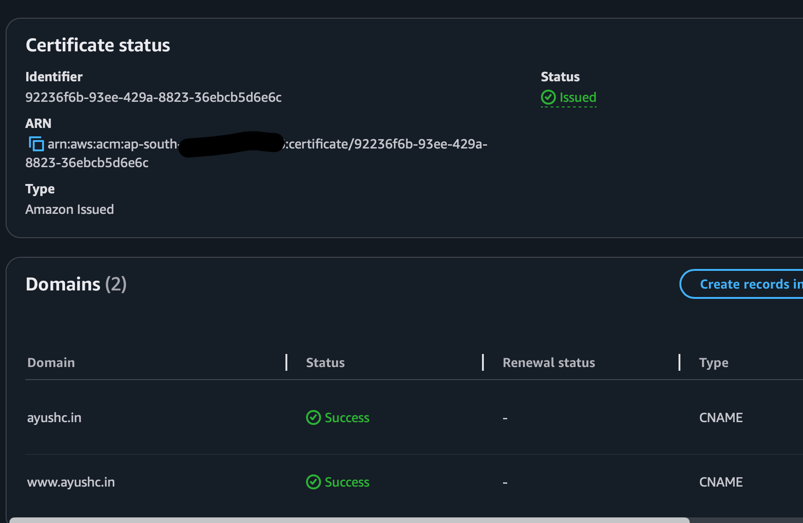

**Frontend — upload screen**
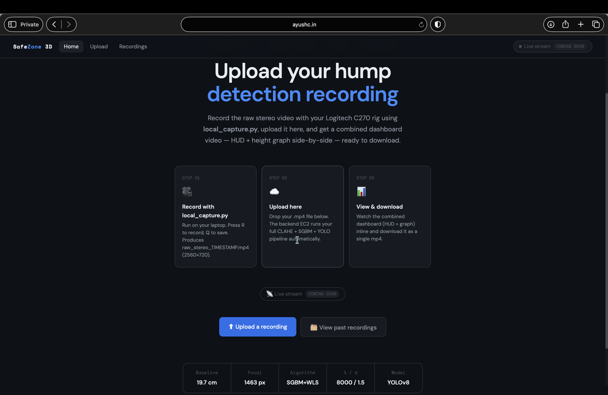

**Frontend — processing/status screen**
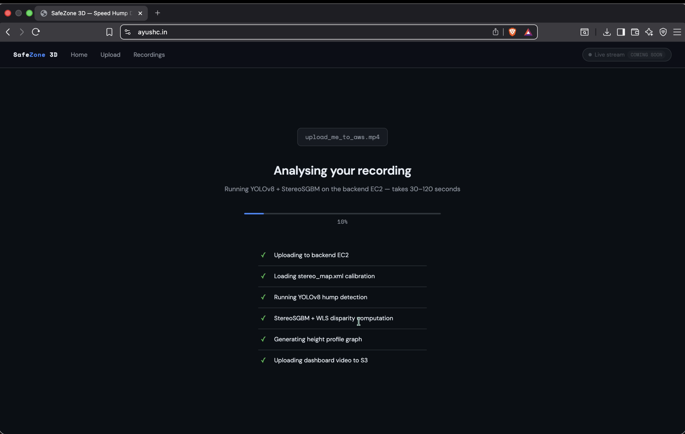

**Frontend — results/dashboard screen**
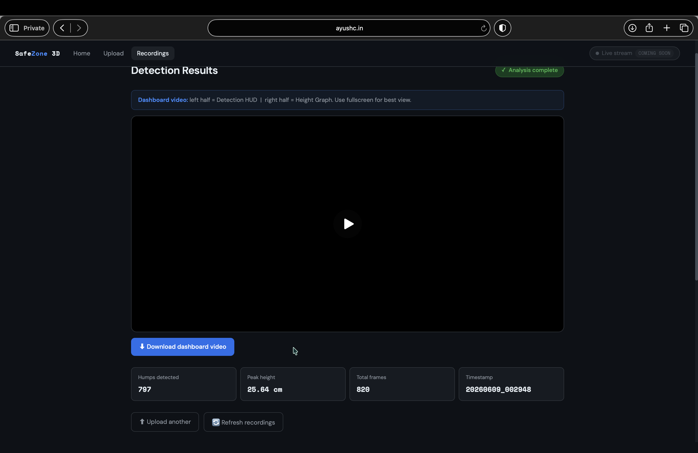


---

## Tech Stack

**AWS:** EC2, Auto Scaling Groups, Application Load Balancer, VPC + VPC Peering, S3, DynamoDB, Lambda, Route 53, ACM, CloudWatch, Security Groups, IAM
**Backend:** Flask, Gunicorn, boto3
**Computer Vision:** OpenCV (StereoSGBM, WLS disparity filtering, CLAHE), YOLOv8 (Ultralytics)
**Frontend:** Vanilla HTML/CSS/JS

---

## Running It

See [`SETUP.md`](./SETUP.md) for full deployment steps (VPC setup, EC2 config, environment variables) and the calibration file requirement.

Quick local backend run:
```bash
pip install -r requirements.txt
python3 app.py
# or production:
gunicorn -w 1 -b 0.0.0.0:5000 --timeout 600 app:app
```

---

